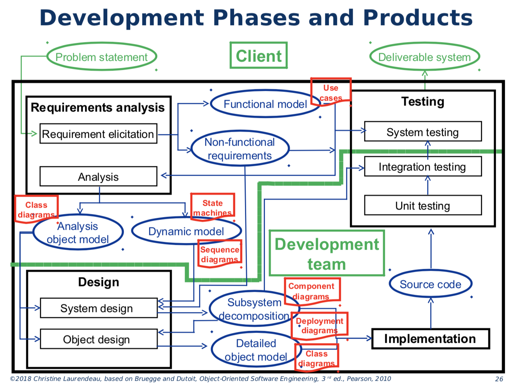
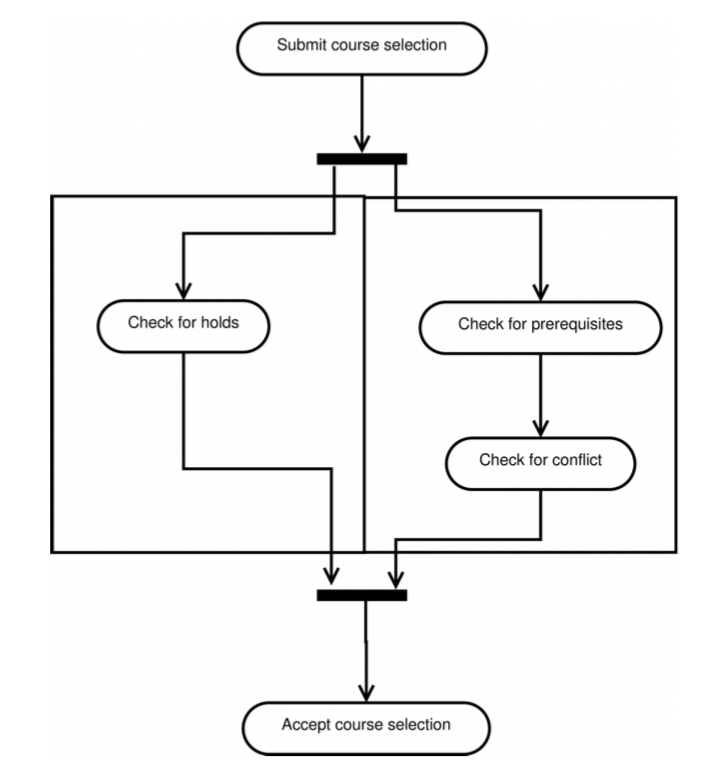
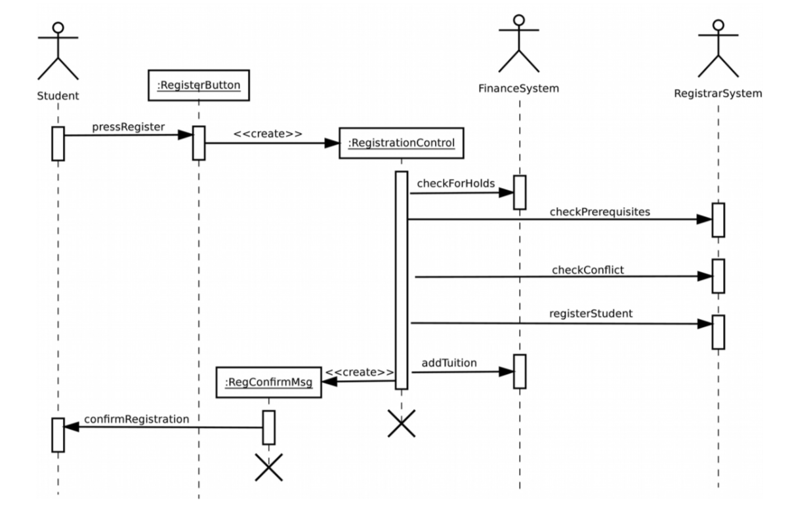
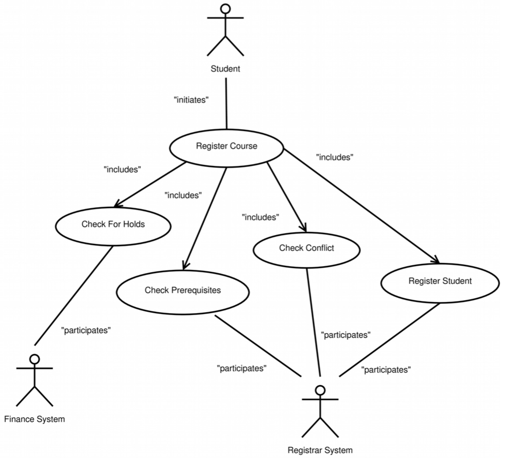
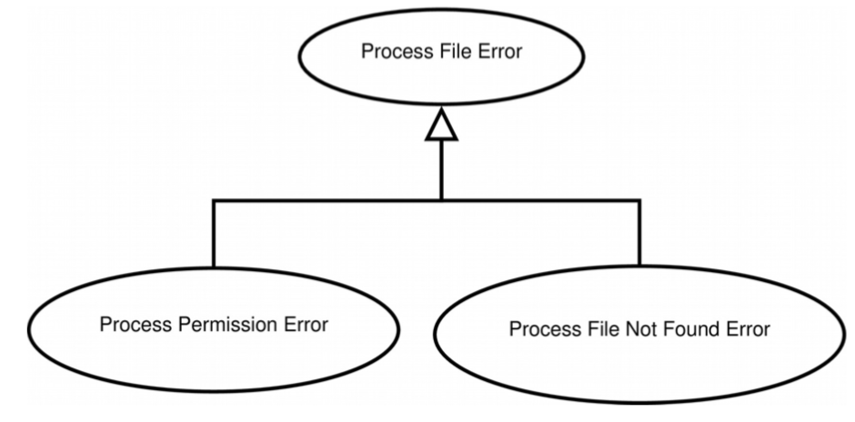

# COMP 3004 Notes

📘 My notes for my Object-Oriented Software Engineering (CS) course – written in markdown.

# Project Requirements

- must be implemented in C++
- must have a UI
  - wither Qt or commandline (fewer marks)

# Table of Contents

`// todo: fill out table of contents` 
`// todo: split notes into files`

# Section 1: Introduction to Software Engineering

**Software Engineering:**
- a problem solving methodology to implement a task

**System:**
- a set of components that work together to accomplish a task

**Process:**
- recipe, a set of instructions
- use a **reliable / modifiable** process to create reliable code

## The Plan
One software engineering process that has two components:
- technical
- management

**Technical Aspects:**
- **understanding the problem**
  - ask the client
  - do research
  - etc.
- to figure out the optimal solution based on design constraints / requirements

**Management Aspects:**
- keeping things on track
- **planning for change**
  - requirements may change at any time

## Technical Aspects

**Application Domain:**
- parts of the real world that are relevent to the problem
- client is the expert of this

**Solution Domain:**
- parts that make up the solution...
- we are the experts of this

**Building Models:**
- build models of the code to see how things would work
- like how buildings and airplanes models are built for **testing / feasibility** before the actual one is built

> - **How do we model the solution domain?**
>   - find a solution to the problem
>   - identify objects required to model the solution
>   - write the code
>   - make sure it works as expected
> - **What activities are involved?**
>   - high-level system design
>   - detailed object design
>   - implementation
>   - testing
> - **How do we model the application domain?**
>   - describe the problem to be solved
>   - describe the system requirements
>   - identify objects required to model the requirements
> - **What activities are involved?**
>   - requirements elicitation
>   - analysis

## Management Aspects

> **Communication tools:** notations, tools, programming conventions 
> **Configuration management:** version control 
> **Rationale management:** why did who make what decision when and how 
> **Software development processes:** sequential, iterative, Agile

## Software Development Phases

> - **Requirements analysis**
>   - requirements elicitation
>   - analysis
> - **Design**
>   - high-level system design
>   - detailed object design
> - **Implementation**
> - **Testing**
>   - unit testing, integration testing
>   - system testing
> - **Deployment and maintenance**

## Software Development Products

**Work Product:** unit of work (e.g. diagrams / source code / etc)
- _functional model:_ system from user's point of view
- _dynamic model:_ internal system behaviour from user's point of view
- _object model:_ system objects / attributes / operations

**Deliverable:** work product delivered to client

## Development Phases

# Section 2: Team Project

## Team Organization

Collaborating with others is critical in any job, and if possible, the people you work must be chosen wisely.

## People Management

Four main factors in managing people:
- **consistency:** everyone on the team treated fairly + equally
  - equally ≠ identically
- **respect:** appreciate everyone's different skills and contributions
- **inclusion:** make sure everyone's ideas are heard
- **honesty:** be honest about your work / skills
  - truth will always come out
  - better if you are the one to break bad news...

**Teams** should have a purpose for existing (i.e. a goal) and should actively work cohesively. It is not simply a group of individuals.

- **balanced skill-set:** everyone should be able to work with all the tools used by the team
- **member roles are assigned:** consistent members' preferences and skill-sets
- **information is shared:** continuous integration and communication
- **honest for reporting work done:** team members should trust but verify each other's progress

### Qualities of a Good Leader

The team leader ensures **things happen**.
- they organize work for the team
- makes sure the team has all the resources it needs
- _encourages, motivates, listens, fixes_

## Informal Team Roles (Primes)

- **documentation** documents formatting + content
- **requirements** document all requirements are documented (traceable)
- **architecture / design** complete and optimal design
- **testing** features match the requirements
- **configuration** package deliverable code

# Section 3: UML Notation

## Unified Modelling Language

**UML** is **a tool** for expressing **system models**:
- _functional models_
  - case diagrams
- _dynamic models_
  - state diagrams
  - sequence diagrams
  - activity diagrams
- _object models_
  - class diagrams

It is used to **facilitate communication** between:
- clients + development team
- within development team

## Case Diagrams

A **case diagram** describes **system behaviour**, as **viewed externally**; they are **graphical** representation of **use-cases**, and establish **system boundaries**.
- external entities: **actors**
  - end users
  - external systems

## Class Diagrams

A **class diagram** describes the **system** in terms of **classes**; they are **graphical** representation of **classes and objects**
- _instance names_ are underlined
- includes:
  - attributes
  - operations
  - associations

## State Machine Diagrams

A **finite state machine** diagram is a **graphical** representation of an object's **state behaviour**: states + transitions.

**state:** a particular set of attributes for an object
**transition:** conditions which change an object's state

## Activity Diagrams

An **activity diagram** describes the **system behaviour**; they are **graphical** representation of **sequencing and coordination**
- describes **control flow / concurrency**

## Sequence Diagrams

A **sequence diagram** is a **graphical** representation of **messages** between external actors and internal objects
- to capture system behaviour
- to show use-cases as distributed across objects
  - every **sequence diagram** describes behaviour of **one use-case**

## Packages

A **UML package** is a group of related UML diagrams, that organizes the diagrams and reduces the diagram complexity.
- e.g. use-case / class / sequence / state machine _diagrams_

# Section 3: Requirement Analysis

## Purpose

Requirement analysis is the first of the 5 phases of the **software development lifecycle**.

1. requirements analysis
2. high-level system
3. detailed object design
4. implementation
5. testing

The **role of development team**, in the requirement analysis is to **understand the problem**, and to **model the application domain**.
- **results in:**
  - functional requirements
  - functional model
  - the non-functional requirements
  - the dynamic model
  - the analysis object model

## Breakdown

### Requirement Elicitation

- first gather a detailed + complete set of requirements
  - from clients information
  - _use-cases + scenarios_
  - should create a **system specification**
    - that can be understood by client
    - from user's point of view
    - including functions + non-functional requirements

### Requirement Analysis

- create high-level model
  - given the requirements
  - focus on **system / object behaviour**
  - from user's point of view
  - non-technical
  - _state machine / sequence activity diagrams_

## Requirement Elicitation

**Elicitation:** getting information from the client, for the development team. 
**Requirements:** what the client wants the system to do (i.e. features / tasks), and design constraints.

### Types of Requirements
**Functional:** what the system does (not how)
- features
- tasks
- interactions between system and external environment

**Non-functional:** the user-visible constraints on the system
- non-functional aspects of the system...
- specific + testable

### Non-Functional Requirements (NFR)
Main categories:
- usability
  - ease of use (colour scheme)
  - online help (documentation)
- reliability
  - load performance
  - dependability (fault-tolerance + security)
- performance
  - response time + throughput
  - availablity
- supportability
  - maintainability
  - portability

## Requirement Specification

**Requirement specification:** is a system definition that the client understands, that serves as a contract between the client and the development team.
- they are **complete / consistent / unambiguous**
- includes functional requirements
  - embodied in the functional model
- non-functional requirements

## Traceability

**Every requirement tracked** through development lifecycle (use-cases -> system functions -> test cases)
- all **dependencies documented**
- facilitates maintenance of project
  - change impact easier to assess
- achieved with numbering requirements and cross-referencing

## Requirement Validation

**Requirement specification** must be validated by the client and development team for:
completeness
- consistency
- clarity
- correctness
- realism
- verifiability
- traceability

## Dorc Slayer Case Study

**Functional requirements:**
- FR-01: player can save the game
- FR-02: player can restore saved game
- FR-03: player can control character
  - FR-03-01: move the character
  - FR-03-02: wield weapon
  - FR-03-03: hit another character
  - FR-03-04: eat food ration from inventory
  - FR-03-05: view inventory

**Non-functional requirements:**
- NF-01 UI shows character health _(usability)_
- NF-02 game should be recoverable after crash _(reliability)_
- NF-03 configurable graphics _(performance)_
- NF-04 show be extensible to other graphics libraries_(supportability)_
- ...

## Requirements Elicitation Activities

**Identifying:**
- actors
- scenarios
- use-cases (+ refining)
- actor / use-case relationships
- initial analysis objects
- non-functional requirements

### Identifying Actors

**An actor** is an entity that **interacts** with the system; they are **role abstraction**.
- e.g. people / users
  - that need **access to the system**
  - that **execute** the main **functionality** of the system
- e.g. external systems
  - for input / output data
  - (high-level functional systems, not implementation details)
    - _OS / libraries are not external systems_

Actors are useful for **defining the system boundaries**.

### Identifying Scenarios

**A scenario** is a _**component**_ of a **use-case** that describes the system as **user interactions**; they describe a **single feature** from the **point of view** of a user.

Scenarios help figure out the main system functionality.
- allows for clients + users to understand:
  - application domain
  - system

Scenarios can be used to create test plans.

To identify a scenario, you can use:
- interviews with clients / users
- application domain + procedure manuals
- UI mock-ups

The goal is to **identify**:
- **tasks** performed by actors
- **information** created / accessed / modified by actors
- **interactions** between actors + system

### Identifying Use-Cases

**A use-case** is a **set of scenarios** that describes user / system interactions, **initiated by an actor**; it distinguishes user steps / system steps.

Use-cases are used to **facilitate client / developer communication**, and to **establish system scope**.

They can be identified by using generalized high-level scenarios and asking clients / users about:
- alternatives
- feature details
- constraints

#### High-Level Use-Case Diagram

`// high-level use-case diagrams contained in a box`

#### Detailed Use-Case Diagram

Then use detailed use-cases.

Use-cases are represented with:
- **table-based text descriptions**
  - unique use-case name
  - actors
  - event flow
    - responses should be indented
    - other use-cases referenced using **extends** / **includes** / **inherits**
  - entry conditions
  - exit conditions
  - quality requirements
  - traceability
- **UML use-case diagrams**
  - there is no order specified
    - it would be shown in the text description
  - there should be no mapping to menu navigation
    - button presses are not states

#### Table-Based Description

### Identifying Relationships

**Relationships:**
- between actors and use-cases:
  - **communication**
    - initiation / participation
    - permissions
- between use-cases:
  - extend
  - include
  - inherit

Use-case relationships are represented using:
- case diagrams (arrows + labels)
- case table-based text description
  - using **extends** / **includes** / **inherits** (bold font)

**Extend** relationship is when one use-case **extends the functionality** of another.
- used only for **exceptional** event flow (i.e. `Exceptions`)
  - e.g. **`ResponseTimeout`** extends **`Register`**
- origin case is not aware about extending case
  - extending case must have specific entry condition

`// arrows can be dotted or not`

**Include** relationship is used to remove **redundant functionality** and break down the system complexity.
- e.g. **`ViewProfile`** for animals and users
- origin use-case triggers included use-case
- included case is not aware of origin use-case

`// arrows can be dotted or not`

**Inheritance** relationships indicates **use-case sub-types**.
- this is not the same as **includes**

### Identifying Initial Analysis Objects

// todo: fill this out

### Identifying Non-Functional Requirements

`// todo: fill this out`