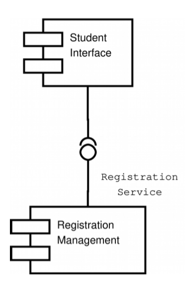

# Section 3: High-Level System Design

1. Overview
2. Initial System Decomposition`*`
3. Design Patterns
4. Refined System Decomposition

`// *midterm will cover up to here`

# Section 3.1: Overview

## Purpose

The development team is responsible for turning the analysis model into a system design model.
- starting to map:
  - processes
  - data structures
  - hardware / software components

**Input:**
- non-functional requirements
- analysis object model
- dynamic model

**Output:**
- system design model
  - subsystem decomposition
  - system architecture strategies

## Work Products

The main tasks are to:
- identify system goals
- design initial system decompositions (subsystems)
- refine subsystems to meet all design goals

## Breakdown

Two main parts:
1. initial system decomposition
  - grouping classes into subsystem
2. refined system decomposition
  - addressing design goals
  - deciding on design strategies [high-level system]

### Initial System Decomposition

The goal of this phase is to determine the design goals / criteria from the requirements [and clients], and to divide the system into maintainable subsystems.
- using:
  - classic system architecture styles
  - established design patterns
  - UML class diagrams, component diagrams, and packages

- **Input:**
  - non-functional requirements
  - analysis object model dynamic model
- **Output:**
  - design goals
  - initial subsystem decomposition

### Refined System Decomposition

This phase establishes the runtime components and nodes.
- **identifies:**
  - persistent data
  - global control flow
  - access control policies
  - subsystem services
- **using:**
  - UML components
  - deployment diagrams

- **Input:**
  - analysis object model
  - dynamic model
  - design goals
  - initial subsystem decomposition
- **Output:**
  - refined subsystem decomposition
  - system architecture strategies

# Section 3.2: Initial System Decomposition

A basic introduction into architectural styles:
- repository
- client-server
- peer-to-peer
- MVC
- 3-tier
- 4-tier

A breakdown of the analysis object model into high-level subsystems, with UML component diagrams.

## Overview

Initial system decomposition establishes design goals based on non-functional requirements.

## Subsystems and Classes

A subsystem is a group of related classes, in the same system, and part of the solution domain.
- they have well-defined interfaces
  - _an interface is the set of public operators of a class_
- encapsulate state and behaviour
- can be assigned to one developer / one team

**Types of Subsystems:**
- logical: has **no** runtime equivalent
- physical: has **explicit** runtime equivalent

In C/C++ related classes are grouped in a sub-directory.

**Class Interface:** set of public operations provided by a class.

**Subsystem Interface:** set of public operations provided by a subsystem.
- _a set of services_

**Service:** related set of operations in a subsystem interface.
- _name must be a noun phrase_

## Services

## Coupling

Coupling is the the number of dependencies (associations) between subsystems.
- **loose coupling**
  - subsystems are relatively independent
  - modifications to one subsystem have strong impact on the other
- **strong coupling**
  - modifications to one subsystem have little impact on the other
  
Subsystems should be as loosely coupled as possible
- e.g. the storage subsytem should not be dependent on database implementation type

## Cohesion

Cohesion refers to the number of dependencies (associations) within a subsystem.
- **high cohesion**
  - many objects in the subsystem are related to each other objects perform similar tasks
- **low cohesion**
  - the subsystem contains many unrelated objects

Subsystems should be as cohesive as possible; but this is a tradeoff with coupling.

## Layers

A layer is a grouping of subsystems providing related services.
- each layer depends on the lower layers
- and have no knowledge of the higher-level layers

**Closed Architecture:**
- each layer can only access the immediate layers below
- loose coupling
- but introduces overhead

**Open Architecture:**
- each layer can access any lower layer

## Partitions

A group of peer subsystems, where each group is responsible for a set of unique services.
- loosely coupled
- groups can operate independently

## System Architecture Styles

- **Repository**
  - synchronized through locks (e.g. mutexes)
- **MVC (model-view-controller)**
  - loose coupling between view and model
    - allows for multiple views with shared models
- **Client-Server**
  - synchronizes only with messages
- **Peer-to-Peer**
  - generalization of client-server
  - higher risk of deadlock
- **Three-Tier**
- interface / application logic / storage layers
- **Four-Tier**
- presentation client / presentation server / application logic / storage layers
- **Pipe and Filter**
  - filters are subsystems
  - pipes are associations between subsystems
  - used for data streams (simple)

## Design Goals

Design goals should take into account:
- **performance**
  - response time
  - throughput
  - memory efficiency
- **dependability**
  - robustness
  - reliability
  - fault tolerance
  - security
  - safety
- **cost**
  - development
  - deployment
  - upgrade
  - maintenance
  - administration
- **maintenance**
  - extensibility
  - modifiability
  - adaptability
  - portability
  - readability
  - traceability
- **end user**
  - utility
  - usability

To **identify design goals** you you want to find the right balance of trade-offs based off the system requirements.
- assign objects in a use case to one subsystem
- create **subsystems to move data** between subsystems
- **minimize** subsystem **associations**
  - and ensure all **objects** in the same subsystem are **related**