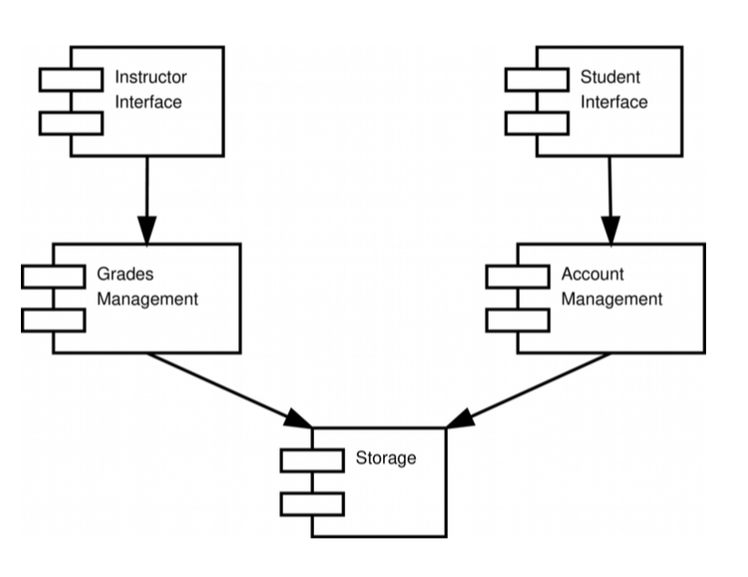
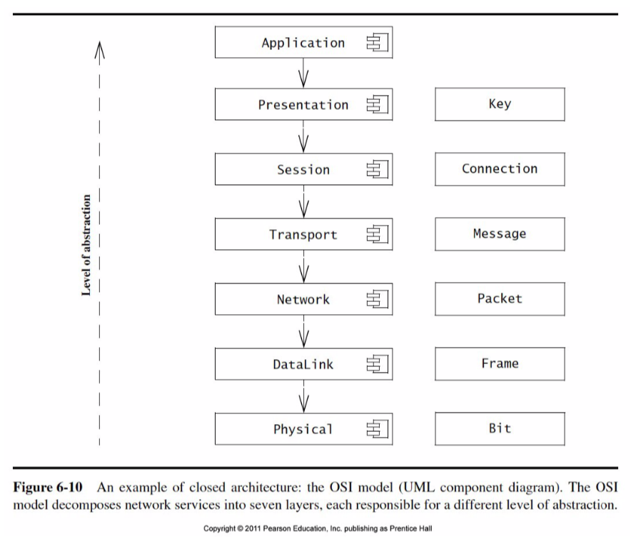
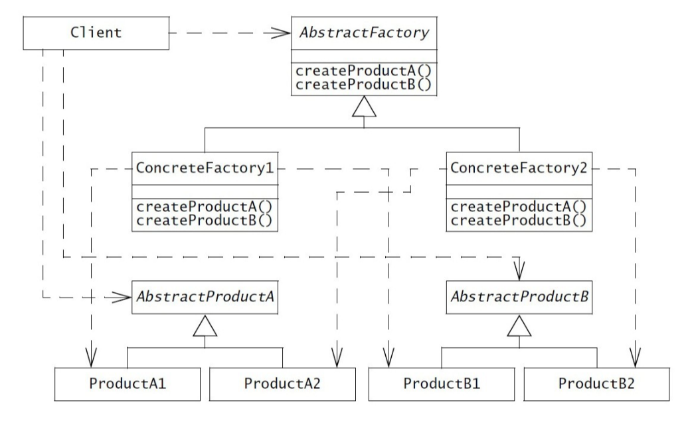
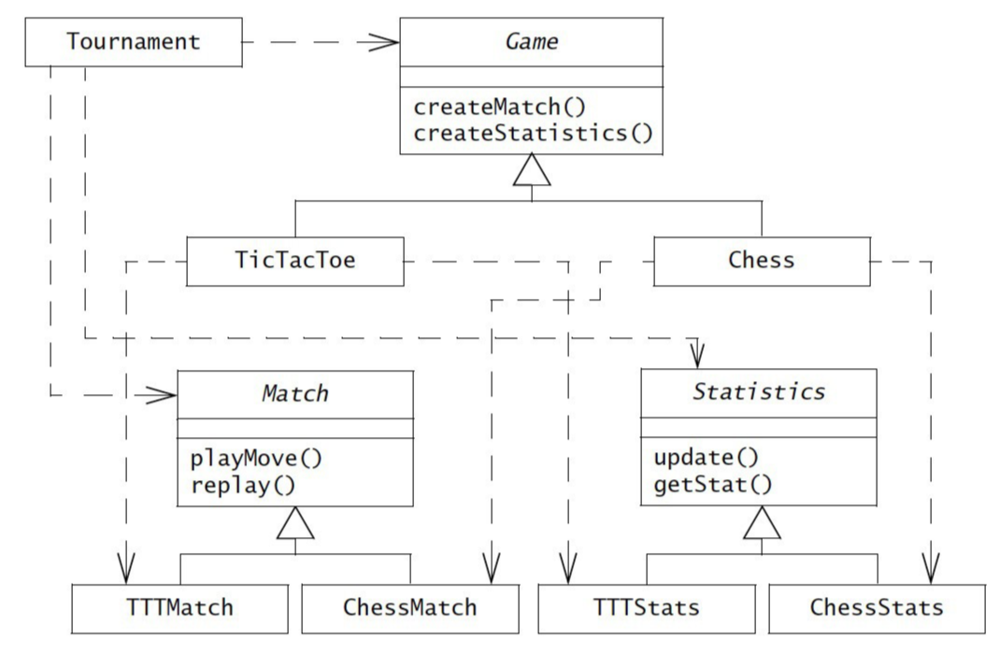
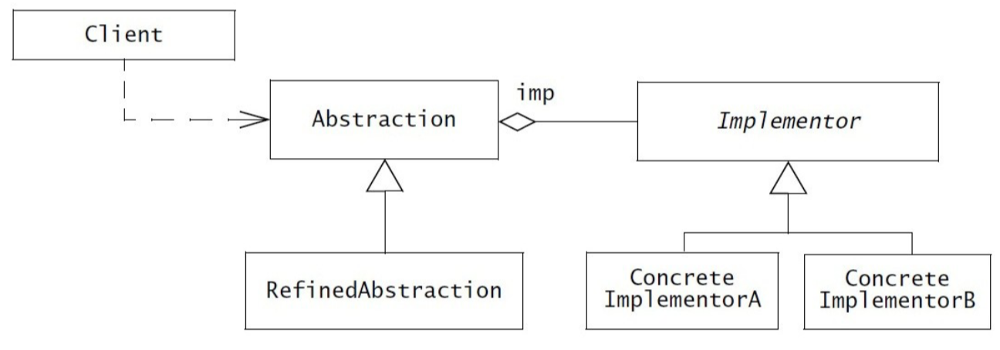

# Section 3: High-Level System Design

# Other Sections

Section 1: [Introduction to Software Engineering](Section%201.md) 
Section 2: [Requirement Analysis](Section%202.md) 
Section 3: [High-Level System Design](Section%203.md) 

# Section 3.1: Overview

1. Overview
2. Initial System Decomposition`*`
3. Design Patterns
4. Refined System Decomposition

`// * midterm will cover up to here`

## Purpose

The development team is responsible for turning the analysis model into a system design model.
- starting to map:
  - processes
  - data structures
  - hardware / software components

**Input:**
- non-functional requirements
- analysis object model
- dynamic model

**Output:**
- system design model
  - subsystem decomposition
  - system architecture strategies

## Work Products

The main tasks are to:
- identify system goals
- design initial system decompositions (subsystems)
- refine subsystems to meet all design goals

## Breakdown

Two main parts:
1. initial system decomposition
  - grouping classes into subsystem
2. refined system decomposition
  - addressing design goals
  - deciding on design strategies [high-level system]

### Initial System Decomposition

The goal of this phase is to determine the design goals / criteria from the requirements [and clients], and to divide the system into maintainable subsystems.
- using:
  - classic system architecture styles
  - established design patterns
  - UML class diagrams, component diagrams, and packages

- **Input:**
  - non-functional requirements
  - analysis object model dynamic model
- **Output:**
  - design goals
  - initial subsystem decomposition

### Refined System Decomposition

This phase establishes the runtime components and nodes.
- **identifies:**
  - persistent data
  - global control flow
  - access control policies
  - subsystem services
- **using:**
  - UML components
  - deployment diagrams

- **Input:**
  - analysis object model
  - dynamic model
  - design goals
  - initial subsystem decomposition
- **Output:**
  - refined subsystem decomposition
  - system architecture strategies

# Section 3.2: Initial System Decomposition

`// midterm includes this section (inclusive)`

## Overview

A basic introduction into architectural styles:
- repository
- client-server
- peer-to-peer
- MVC
- 3-tier
- 4-tier

Initial system decomposition establishes design goals based on non-functional requirements.

A breakdown of the analysis object model into high-level subsystems, with UML component diagrams.

## Subsystems and Classes

A subsystem is a group of related classes, in the same system, and part of the solution domain.
- they have well-defined interfaces
  - _an interface is the set of public operators of a class_
- encapsulate state and behaviour
- can be assigned to one developer / one team

**Types of Subsystems:**
- logical: has **no** runtime equivalent
- physical: has **explicit** runtime equivalent

In C/C++ related classes are grouped in a sub-directory.

**Class Interface:** set of **public operations** provided by a **class**.

**Subsystem Interface:** set of **public operations** provided by a **subsystem**.
- _a set of services_

**Service:** related **set of operations** in a **subsystem interface**.
- subsystems offer services to other subsystems
- _name must be a noun phrase_

## Services

## Coupling

Coupling is the the number of dependencies (associations) between subsystems.
- **loose coupling** [good]
  - subsystems are relatively independent
  - modifications to one subsystem have strong impact on the other
- **strong coupling** [bad]
  - modifications to one subsystem have little impact on the other
  
Subsystems should be as loosely coupled as possible
- e.g. the storage subsytem should not be dependent on database implementation type

## Cohesion

Cohesion refers to the number of dependencies (associations) within a subsystem.
- **high cohesion** [good]
  - many objects in the subsystem are related to each other objects perform similar tasks
- **low cohesion** [bad]
  - the subsystem contains many unrelated objects

Subsystems should be as cohesive as possible; but this is a tradeoff with coupling.

## Layers

A layer is a grouping of subsystems providing related services.
- each layer depends on the lower layers
- and have no knowledge of the higher-level layers

**Closed Architecture:**
- each layer can only access the **immediate layers below**
  - loose coupling [good]
  - but introduces overhead [bad]

**Open Architecture:**
- each layer can access **any lower layer**
  - higher coupling but no additional overhead

## Partitions

Partitions are a **group of peer subsystems**, where **each group** is responsible for a **set of unique services**.
- loosely coupled
- groups can operate independently

System decomposition is made up of partitioning and layering of subsystems.

## System Architecture Styles

**Software architectural styles** are **ways of organizing / grouping subsystems** at the highest levels, and can be used as a basis for new systems.

- **Repository**
  - subsystems:
    - all access single data structure
    - loosely coupled [good] + highly coupled [bad]
    - communicate solely through repository [bottleneck]
  - synchronized through repository locks (e.g. mutexes)
  - good for:
    - complex data processing
    - adding new services
  - _e.g. database management systems / compilers_
- **MVC (model-view-controller)**
  - loose coupling between view and model [good]
    - allows for multiple views with shared models
  - maps well to entity-boundary-control objects
    - _based on the observer design pattern_
- **Client-Server**
  - server subsystems provide services to client subsystems
    - using remote procedure calls (RPC) + sockets
  - client subsystems interact with users
  - subsystems are independent (loose coupling) [good]
    - good for distributed systems
  - synchronizes only with messages
  - _special case of repository_
  - _e.g. information system with central database_
- **Peer-to-Peer**
  - generalization of client-server
    - subsystems can be both clients or servers
  - good for distributed systems
  - synchronizes only with messages
  - higher risk of deadlock
  - _e.g. database that accepts requests and notifies others of any changes_
- **Three-Tier**
  - interface / application logic / storage layers
    - interface: boundary objects
    - application logic: control / entity objects
    - storage: implements storage and retrieval of persistent objects
      - can be shared by multiple applications
    - _like MVC but storage is external to application?_
- **Four-Tier**
  - presentation client / presentation server / application logic / storage layers
    - same as three-tier but application logic split:
      - client layer [located on client hosts]
      - server layer [located on server hosts]
  - _e.g. facebook? different client interfaces for each user?_
- **Pipe and Filter**
  - filters are subsystems
  - pipes are associations between subsystems
  - used for data streams (simple)
  - bad for complex interactions between filters
  - _e.g. bash shell_

## Design Goals

Design goals should take into account:
- **performance**
  - response time
  - throughput
  - memory efficiency
- **dependability**
  - robustness
  - reliability
  - fault tolerance
  - security
  - safety
- **cost**
  - development
  - deployment
  - upgrade
  - maintenance
  - administration
- **maintenance**
  - extensibility
  - modifiability
  - adaptability
  - portability
  - readability
  - traceability
- **end user**
  - utility
  - usability

To **identify design goals** you you want to find the right balance of trade-offs based off the system requirements.
- assign objects in a use-case to one subsystem
- create **subsystems to move data** between subsystems
- **minimize** subsystem **associations**
  - and ensure all **objects** in the same subsystem are **related**

To **identify** subsystems:
- assign objects in a use-case to one subsystem
- create dedicated subsystems to move data between subsystems
- minimize associations between subsystems
  - ensure objects within a subsystem are related

# Section 3.3 : Design Patterns

`// post-midterm`

Design patterns are sets of classes and their associations that provide a framework to solve common design problems. They should be robust, modifiable, and adaptable.

## Types of Design Problems
- **creational:** object creation [mechanisms]
  - _abstract factory_
- **structural:** simplification of object associations / relationships
  - _adapter_
  - _bridge_
  - _composite_
  - _façade_
  - _proxy_
- **behavioural:** communication patterns between objects
  - _command_
  - _observer_
  - _strategy_

## Abstract Factory

An **Abstract Factory** design pattern enables creation of objects, independent of the client.
- it provides an interface to inherited factory classes, with different implementations.
  - _e.g. products from different manufacturers_

The arena case study implements this design pattern, where the `Game` object is an abstract factory.

Notice how

## Adapter

An **Adapter** design pattern exists as a wrapper around existing / legacy code to provide a new interface to the client.
- _e.g. new user interface for an old command line application_

`// only works if it's a wrapper for existing code`

## Bridge

A **Bridge** design pattern allows for alternate implementations with a single interface.
- e.g. _different storage implementations for one store_

In this picture, the store would be the abstraction, and the concrete implementors would be different storage implementations.

## Composite

`// todo finish this`